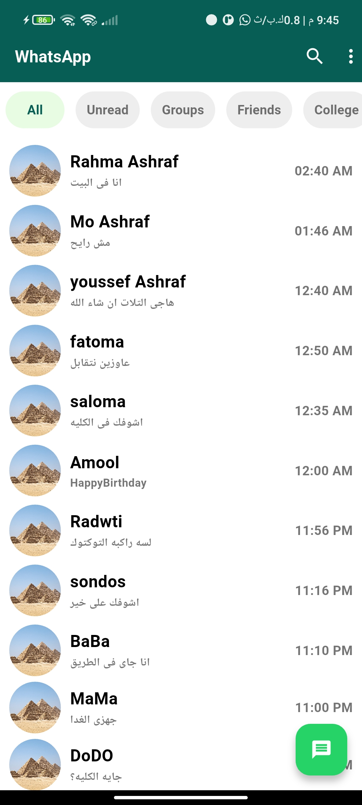
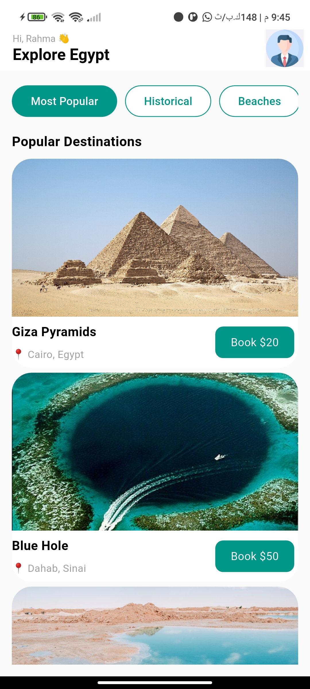
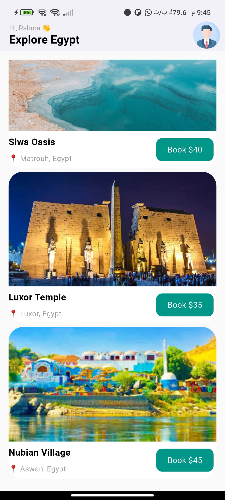

# Flutter UI Practice App

A simple Flutter project built to practice UI design and multi-screen navigation.

## 📱 Features

- Two screens UI project:
    - **WhatsApp-like Screen**: chat list UI with categorized tabs (All, Family, Groups, etc.) under the AppBar.
    - **Popular Destinations Screen**: travel booking UI showing destination cards with images and categories (Most Popular, Historical, Beaches, etc.).
- Scrollable layouts under AppBars.
- Basic UI structuring and design practice.

## 🧭 Screens

- `whats_app.dart`: Chat-style screen similar to WhatsApp.
- `popular_destinations.dart`: Travel destinations booking screen.

## 📸 Screenshots

### WhatsApp Screen

### Popular Destinations Screen

## 🛠 Tech Stack

- Flutter
- Dart

## 🎯 Purpose

This project was created for practicing:
- Complex UI layouts
- Scrollable widgets
- Category tabs design
- Multi-screen navigation

---